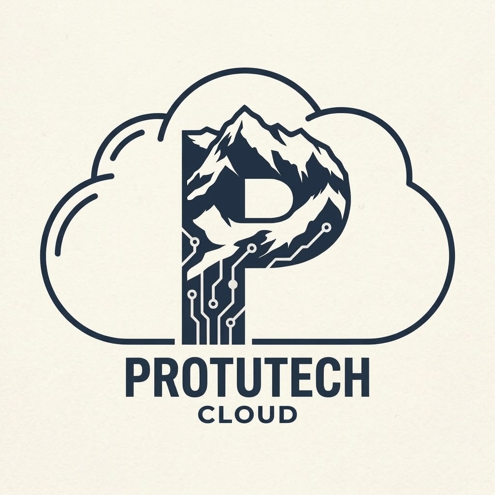

# proxDiscord

Display live Proxmox VE server stats directly on your Discord profile using Discord Rich Presence.

<p align="center">
  
</p>

## Features
- **Auto-Rotating Screens**: Cycles through your complete setup every 15 seconds:
  1. **Proxmox Overview**: Node status, Uptime, running VMs/LXCs, CPU, RAM, and Storage
  2. **Crypto Mining**: Live GPU & CPU cryptocurrencies being mined (Pearl, Xelis, etc.)
  3. **Game Activity**: Live auto-detection of games currently playing on your PC (Steam, Roblox, Minecraft, Epic Games, Riot, etc.)
- **Dynamic Image Swapping**:
  - Automatically fetches official game banners for all Steam games.
  - Supports custom game/mining images via Discord Developer Portal asset keys or direct HTTPS URLs in `config.json`.
  - Displays your Protutech Cloud logo as a corner badge (`small_image`) whenever a game or crypto image is active!
- **Active Guests Badge**: Shows a live `(16 of 16)` active Proxmox guest count.
- **Background Mode & Auto-Start**: Runs silently and starts with Windows on boot.
- **Self-Healing**: Automatically reconnects if Discord or network restarts.

---

## Quick Setup

### 1. Install Dependencies
```bash
pip install -r requirements.txt
```

### 2. Configure
Copy `config.example.json` to `config.json`:
```bash
copy config.example.json config.json
```
Fill in your Proxmox connection details, Discord Application ID, and optional game images in `config.json`:
```json
{
  "discord_client_id": "YOUR_DISCORD_APPLICATION_ID",
  "server_label": "Homelabs",
  "proxmox_host": "https://192.168.0.2:8006",
  "proxmox_node": "Protutech",
  "proxmox_token_id": "root@pam!discord-rpc",
  "proxmox_token_secret": "YOUR_TOKEN_SECRET_HERE",
  "update_interval_seconds": 15,
  "large_image": "protutech",
  "show_party_badge": true,
  "enable_kryptex_screen": true,
  "enable_game_activity": true,
  "game_images": {
    "roblox": "roblox",
    "minecraft": "minecraft",
    "kryptex": "kryptex"
  }
}
```

> **Tip on Game Images**:
> - **Steam Games**: Automatically pulls the official game header banner from Steam CDN.
> - **Non-Steam Games**: You can either upload asset images to your [Discord Developer Portal](https://discord.com/developers/applications) under *Rich Presence -> Art Assets* and use the asset key, or paste any direct image URL (`https://...`).

### 3. Run
- **Interactive**: Double-click `run.bat`
- **Background (Silent)**: Double-click `run-background.vbs`
- **Start with Windows**: Double-click `install_startup.bat`
- **Remove from Windows Startup**: Double-click `uninstall_startup.bat`
